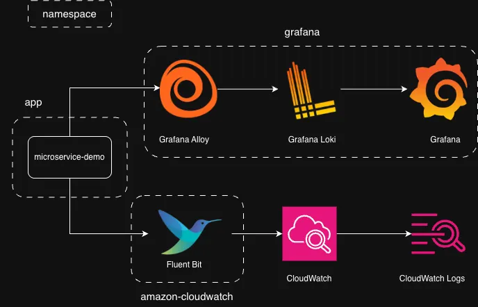

# microservices-demo-log-monitoring

[microservices-demo](https://github.com/GoogleCloudPlatform/microservices-demo) のログを Grafana Loki と Amazon CloudWatch Logs に送信するリポジトリです。



## 環境構築

### EKS クラスターの構築

```bash
cd eksctl
eksctl create cluster -f cluster-config.yaml
```

### Terraform モジュールのデプロイ

- `terraform/` 以下に Terraform モジュールがある
- 各モジュール内に `terraform.tfvars` を作る
- `variables.tf` の値を `terraform.tfvars` に記述する

```bash
cd terraform/<module_name>
terraform apply
```

## 環境破壊

### Terraform モジュールの破壊

```bash
cd terraform/<module_name>
terraform destroy
```

### EKS クラスターの破壊

```bash
cd eksctl
eksctl delete cluster -f cluster-config.yaml --disable-nodegroup-eviction
```
